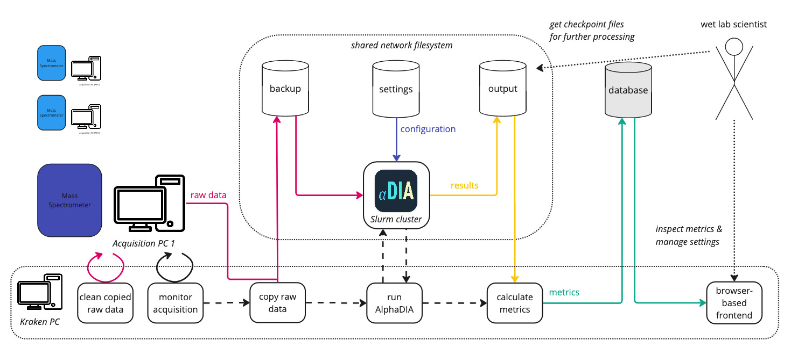

[](https://github.com/MannLabs/alphakraken/actions/workflows/branch-checks.yaml)


# AlphaKraken

A fully automated data processing and analysis system for mass spectrometry experiments:
- monitors acquisitions on mass spectrometers
- copies raw data to a backup location
- runs AlphaDIA on every sample and provides metrics in a web application



Currently supported:
- quanting software: [AlphaDIA](https://github.com/MannLabs/alphadia), custom (experimental)
- compute environment: [Slurm](https://slurm.schedmd.com/documentation.html), generic SSH (experimental)
- vendors: Bruker, Sciex, Thermo


Regular users should find all required documentation in the AlphaKraken WebApp.
This documentation is relevant only for developers and administrators.

## System Requirements

The following architecture is required to run AlphaKraken: a local PC, a compute cluster, and a shared file system.

**Local PC**: at least one local PC with a recent linux distribution, 16GB+ RAM and 4+ CPU cores,
with network access to the acquisition PCs, to the shared file system and to the compute cluster.

**Distributed compute environment**: compute cluster with Slurm workload manager that can be accessed via SSH.
Note: such a cluster can be set up quite easily, cf. [here](https://github.com/SergioMEV/slurm-for-dummies).

**Shared File System**: a file system that can be accessed from the local PC and the compute cluster.


## Quick start
For the impatient:

```bash
git clone https://github.com/MannLabs/alphakraken.git && cd alphakraken
echo -e "AIRFLOW_UID=$(id -u)" > envs/.env-airflow
ENV=local && export ENV=$ENV
./compose.sh --profile dbs up airflow-init
./compose.sh --profile local up --build -d
```
After startup, the airflow webserver runs on http://localhost:8080/ (default credentials: airflow/airflow), the Streamlit webapp on http://localhost:8501/ .
See [here](docs/development.md#local-testing) on how to test the system locally.

See the [deployment.md](docs/deployment.md) for detailed instructions.


## Documentation Structure

For detailed information, please refer to the following documentation files:

- [deployment.md](docs/deployment.md) - Setup and deployment instructions
- [instruments.md](docs/instruments.md) - Adding and configuring instruments
- [development.md](docs/development.md) - Development setup and testing procedures
- [maintenance.md](docs/maintenance.md) - Maintenance procedures and post-reboot instructions, common issues and solutions


## Customization
The `alphakraken.yaml` file offers some options regarding the behavior of the system,
and `webapp/columns_config.yaml` allows to customize the columns and plots shown in the web application.

Currently, other customizations require changes to the source code.
However, many components (e.g. around quanting, metrics calculation) are already designed to be easily customizable.

---

## About

An open-source Python package of the AlphaX ecosystem from the [Mann Labs at the Max Planck Institute of Biochemistry](https://www.biochem.mpg.de/mann).

---

## License

AlphaKraken is developed by the [Mann Labs at the Max Planck Institute of Biochemistry](https://www.biochem.mpg.de/mann) and is freely available with an [Apache License](LICENSE.txt).
External Python packages have their own licenses, which can be consulted on their respective websites.

---
