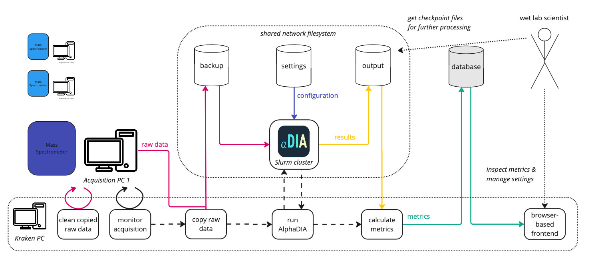

# AlphaKraken

A fully automated data processing and analysis system for mass spectrometry experiments:
- monitors acquisitions on mass spectrometers
- copies raw data to a backup location
- runs AlphaDIA on every sample and provides metrics in a web application

## Documentation Structure

For detailed information, please refer to the following documentation files:

- [DEPLOYMENT.md](docs/deployment.md) - Setup and deployment instructions
- [INSTRUMENT_MANAGEMENT.md](docs.instruments.md) - Adding and configuring instruments
- [DEVELOPMENT.md](docs/development.md) - Development setup and testing procedures
- [TROUBLESHOOTING.md](docs/troubleshooting.md) - Maintenance procedures and post-reboot instructions, common issues and solutions

## Important note for users

To not interfere with the automated processing, please stick to the following simple rule:

> Do not touch the acquisition folders*!

*i.e. the folders where the acquisition software writes the raw files to. In particular,
do not **delete**, **rename** or **open** files in these folders and do not **copy** or **move** files *from* or *to* these folders!

Regular users should find all required documentation in the [AlphaKraken WebApp](http://<kraken_url>).
The rest of this Readme is relevant only for developers and administrators.

---

## About

An open-source Python package of the AlphaX ecosystem from the [Mann Labs at the Max Planck Institute of Biochemistry](https://www.biochem.mpg.de/mann).

---

## License

AlphaDIA was developed by the [Mann Labs at the Max Planck Institute of Biochemistry](https://www.biochem.mpg.de/mann) and is freely available with an [Apache License](LICENSE.txt).
External Python packages have their own licenses, which can be consulted on their respective websites.

---
