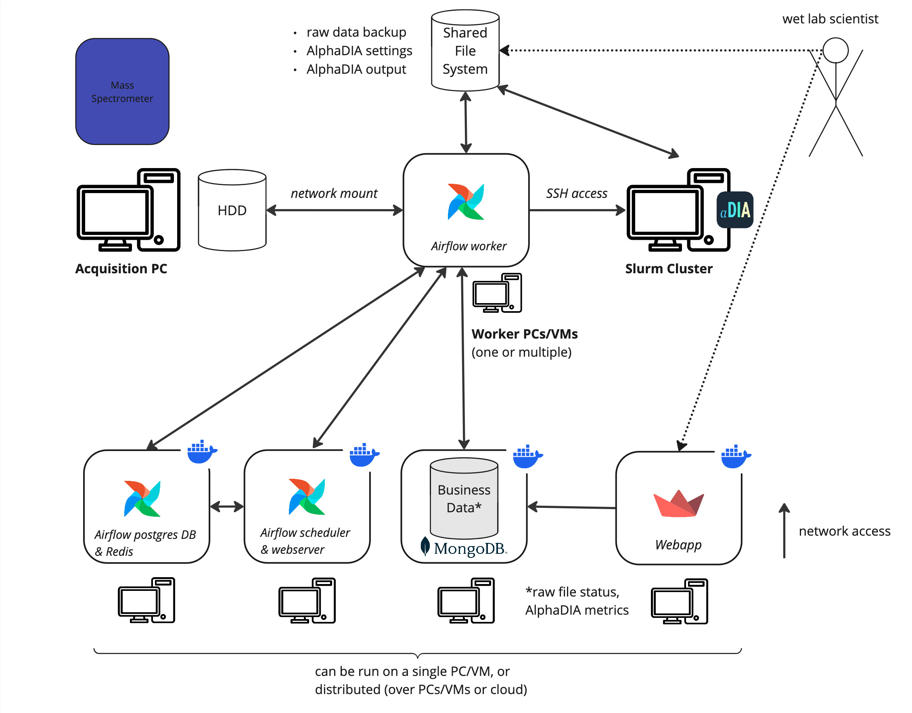

## Deployment
This guide is both valid for a local setup (without connection to pool or cluster), and for sandbox/production setups.

Upfront, set an environment variable `ENV`, which is either `local`, `sandbox`, or `production`, e.g.
```bash
ENV=local && export ENV=$ENV
```
This will use the environment variables defined in `envs/${ENV}.env` and point shell scripts to the correct configuration.

### Overview


### Deployment workflow: 'local' vs. 'sandbox' vs. 'production'
All features should be tested on `local` before deploying them to the `sandbox` environment
for further testing. `sandbox` is technically equivalent to `production`, but it does not contain any valuable
data and therefore it's perfectly fine to break and/or wipe it.
There, depending on the scope of the feature, and of the likeliness of breaking something,
another test with real data might be necessary.

Use common sense when deciding the scope of testing:
- Cosmetic changes (e.g. webapp text/styling): test on local should suffice
- Infrastructure changes (e.g. new DB fields) or data handling changes (e.g. file operations): test on local and sandbox

Only a well-tested feature should be deployed to production. Make sure a pull request is always self-contained
and 'shippable', i.e. deployment to production should be possible at any time. After a production deployment,
it is good practise to check for errors in the Airflow UI.

### Initial deployment
All commands in this Readme assume you are in the root folder of the repository.
Please note that running and developing the alphakraken is only tested for MacOS and Linux
(the UI can be accessed from any OS, of course).

#### One-time initializations
The following steps are required for both the `local` and the `sandbox`/`production` deployments.
For the latter, additional steps are required, see [here](#additional-steps-required-for-initial-sandboxproduction-deployment).

1. Install [Docker](https://docs.docker.com/engine/install/ubuntu/) and `python3`.

2. Clone the repository into a folder and `cd` into it.

3. Set the current user as the user within the airflow containers and get the correct permissions on the "logs"
directory (otherwise, `root` would be used)
```bash
echo -e "AIRFLOW_UID=$(id -u)" > envs/.env-airflow
```

4. On the PC that will host the internal Airflow database (this is not the MongoDB!) run
```bash
./compose.sh --profile dbs up airflow-init
```
Note: depending on your operating system and configuration, you might need to run `docker compose` command with `sudo`.

Now run the containers (see below).
The following initialization steps need to be done once the containers are up:

5. In the Airflow UI, set up the SSH connection to the cluster (see [below](#setup-ssh-connection)).
If you don't want to connect to the cluster, just create the connection of type
"ssh" and name "cluster_ssh_connection" with some dummy values for host, username, and password.
In this case, make sure to set the Airflow variable `debug_no_cluster_ssh=True` (see below).

6. In the Airflow UI, set up the required Pools (see [below](#setup-required-pools)).

#### Run the containers (local version)
Start all docker containers required for local testing with
```bash
./compose.sh --profile local up --build -d
```
After startup, the airflow webserver runs on http://localhost:8080/ (default credentials: `airflow`/`airflow`), the Streamlit webapp on http://localhost:8501/ .

To spin all containers down again, use
```bash
./compose.sh --profile local down
```
A more graceful 'warm shutdown' can be achieved by
```bash
./compose.sh --profile local stop
```

See below for [some useful Docker commands](maintenance.md/#some-useful-docker-commands).


### Additional steps required for initial sandbox/production deployment

The main differences between the `local` and the `sandbox`/`production` deployments are:
- `local` has all services running on the same machine within the same docker-compose network,
whereas `sandbox`/`production` is per default distributed over two machines
- `sandbox`/`production` needs additional steps to configure the cluster and the network bind mounts

The different services can be distributed over several machines. The only important thing is that there
it exactly one instance of each of the 'central components': `postgres-service`, `redis-service`, and `mongodb-service`.
One reasonable setup is to have the Airflow infrastructure and the MongoDB service on one machine,
and all workers on another. This is the current setup in the docker-compose, which is reflected by the
profiles `infrastructure` and `workers`, respectively. If you move one of the central components
to another machine, you might need to adjust the `*_HOST` variables in the
`./env/${ENV}.env` files (see comments there). Of course, one machine could also host them all.

Make sure that the time is in sync between all machines, e.g. by using the same time server.

For production: set strong passwords for `AIRFLOW_PASSWORD`, `MONGO_PASSWORD`, and `POSTGRES_PASSWORD`
in `./env/production.env` and `MONGO_INITDB_ROOT_PASSWORD` in `./env/.env-mongo`.
Make sure they don't contain special characters (e.g. '\', '#', '@', '$', ..) as they might interfere with name resolution in `docker-compose.yaml`.

#### Required users
Two different users are recommended for the deployment:
one ("`kraken-write`") that has write access to the `backup` pool folder,
and one  ("`kraken-read`") that has only _read_ access.
Both users should be able to write to the `logs` and `output` directories, and to read from `settings`.

#### On all machines
1. Disable the automatic restart of the Docker service
([cf. here](https://docs.docker.com/engine/install/linux-postinstall/#configure-docker-to-start-on-boot-with-systemd))
```bash
sudo systemctl disable docker.service
sudo systemctl disable docker.socket
sudo systemctl disable containerd.service
```
This is currently required, as manual work is needed anyway after a machine reboot
(see [below](maintenance.md/#actions-to-take-after-a-machine-reboot))
and thus the automated start of containers is not desired.

#### On the PC (VM) hosting the dbs (MongoDB, Airflow Postgres, Redis)

0. `ssh` into the PC/VM, `cd` to the alphakraken source directory, and set `export ENV=sandbox` (`export ENV=production`).

2. Follow the steps for after a restart [below](maintenance.md/#restart-of-pcvm-hosting-the-dbs-mongodb-airflow-postgres-db-redis).


#### On the PC (VM) hosting the airflow infrastructure (scheduler, webserver)

0. `ssh` into the PC/VM, `cd` to the alphakraken source directory, and set `export ENV=sandbox` (`export ENV=production`).

1. Set up the [pool bind mounts](#set-up-pool-bind-mounts) for `airflow_logs` only. Here, the logs of the individual task runs will be stored
for display in the Airflow UI.

2. Follow the steps for after a restart [below](maintenance.md/#restart-of-pcvm-hosting-the-workers--infrastructure).

#### On the PC (VM) hosting the workers
0. `ssh` into the PC/VM, `cd` to the alphakraken source directory, and set `export ENV=sandbox` (`export ENV=production`).

1. Set up the [pool bind mounts](#set-up-pool-bind-mounts) for all instruments and `logs`, `backup` and `output`.

2. Follow the steps for after a restart [below](maintenance.md/#restart-of-pcvm-hosting-the-workers--infrastructure).

#### URL redirect
In case you want to set up a URL redirect from one PC to one or multiple others, do the following on the redirecting PC:
1. Edit `nginx.conf`: substitute the placeholder IP adresses (e.g. `255.255.0.1`) with the correct ones.
2. Start the respective container `./compose.sh up nginx --build --force-recreate -d`, see the folder `nginx_logs` for logs

#### On the cluster
1. Log into the cluster using the `kraken-read` user.
2. Create this directory
```bash
mkdir -p ~/slurm/jobs
```
3. Copy the cluster run script `submit_job.sh` to `~/slurm`.
Make sure to update also this file when deploying a new version of the AlphaKraken.

4. Set up AlphaDIA (see [below](#setup-alphadia-on-the-cluster)).

### General note on how Kraken gets to know the data

Each worker needs two 'views' on the pool backup and output data.

The first view enables read/write access,
by mounting on the Kraken host PC a specific (network) folder (e.g. `\\pool-backup\pool-backup` or `\\pool-output\pool-output`)
using `cifs` mounts (wrapped by `mount.sh`)
to a target folder and then mapping this target folder to a worker container
in `docker-compose.yaml`.

The second view is the location of the data as seen from the cluster
(e.g. `/fs/pool/pool-backup` or `/fs/pool/pool-output`),
which is required to set the paths for the cluster jobs correctly.

For instruments, only the first type of view is required, as the cluster does not access the instruments directly.


### Set up pool bind mounts
The workers need bind mounts set up to the pool filesystems for backup and reading AlphaDIA output data.
All airflow components (webserver, scheduler and workers) need a bind mount to a pool folder to read and write airflow logs.
Additionally, workers need one bind mount per instrument PC is needed (cf. section below).

0. (on demand) Install the `cifs-utils` package (otherwise you might get errors like
`CIFS: VFS: cifs_mount failed w/return code = -13`)
```bash
sudo apt install cifs-utils
```

1. Create folders `settings`, `output`, and `airflow_logs` in the desired pool location(s), e.g. under `/fs/pool/pool-alphakraken`.

2. Make sure the variables `MOUNTS_PATH`, `BACKUP_POOL_FOLDER` `QUANTING_POOL_FOLDER` in the `envs/${ENV}.env` file are set correctly.
Set them also in the `envs/alphakraken.$ENV.yaml` file (section: `locations`).

3. Mount the backup, output and logs folder. You will be asked for passwords.
```bash
./mount.sh backup
./mount.sh output
./mount.sh logs
```

Note: for now, user `kraken-write` should only have read access to the backup pool folder, but needs `read/write` on the `output`
folder. If you need to remount one of the folders, add the `umount` option, e.g.
`./mount.sh output umount`.

IMPORTANT NOTE: it is absolutely crucial that the mounts are set correctly (as provided by the `envs/alphakraken.$ENV.yaml` file)
as the workers operate only on docker-internal paths and cannot verify the correctness of the mounts.

### Setup SSH connection
This connection is required to interact with the SLURM cluster.

1. Open the Airflow UI, navigate to "Admin" -> "Connections" and click the "+" button.
2. Fill in the following fields:
    - Connection Id: `cluster_ssh_connection`
    - Conn Type: `SSH`
    - Host: `<cluster_head_node_ip>`  # the IP address of a cluster head node, in this case `<cluster_head_node>`
    - Username: `<user name of user kraken-read>`
    - Password: `<password of user kraken-read>`
3. (optional) Click "Test" to verify the connection.
4. Click "Save".
Note: make sure to use the `kraken-read` user with read-only access to the backup pool folder.

### Setup required pools
Pools are used to limit the number of parallel tasks for certain operations. They are managed via the Airflow UI
and need to be created manually once.
1. Open the Airflow UI, navigate to "Admin" -> "Pools".
2. For each pool defined in `settings.py:Pools`, create a new pool with a sensible value (see suggestions in the `Pools` class).

### Setup AlphaDIA on the cluster
For details on how to install AlphaDIA on the SLURM cluster, follow the AlphaDIA
[https://github.com/MannLabs/alphadia/blob/main/docs/installation.md#slurm-cluster-installation](Readme).

In a nutshell, to install a certain version, e.g. `VERSION=1.7.0`:

1. Log in (make sure to use the same user as configured in the [SSH connection](#setup-ssh-connection)!)
```bash
ssh kraken-read@<cluster_head_node>
```
2. create a new conda environment and activate it
```bash
conda create --name alphadia-${VERSION} python=3.11 -y && conda activate alphadia-${VERSION}
```
3. Install desired version
```bash
pip install "alphadia[stable]==${VERSION}"
```
Make sure the environment is named `alphadia-${VERSION}`, as this is the scheme that is expected by the module starting
the AlphaDIA jobs.
Also, don't forget to install `mono` (cf. AlphaDIA Readme).


### Deploying new code versions
These steps need to be done on all machines that run alphakraken services.
Make sure the code is always consistent across all machines!
0. If in doubt, create a  backup copy of the `mongodb_data_$ENV` and `airflowdb_data_$ENV` folders (on the machine that hosts the DBs).
1. On each machine, pull the most recent version of the code from the repository using `git pull` and a personal access token.
2. Check if there are any special changes to be done (e.g. updating `submit_job.sh` on the cluster,
new mounts, new environment variables, manual database interventions, ..) and apply them.
3. (when deploying workers) To avoid copying processes being interrupted, in the Airflow UI set the size of the `file_copy_pool` to 0 and wait until all `copy_raw_file` tasks are finished.
4. Stop all docker compose services that need to be updated across all machines using the `./compose.sh --profile <some profile> stop` command.
5. Start all docker compose services again, first the `infrastructure` services, then the `workers` services.
6. Set the size of `file_copy_pool` to the number it was before.
7. Normal operation should be resumed after about 5 minutes. Depending on when they were shut down, some tasks
could be in an `error` state though. Check after a few hours if some files are stuck and resolve the issues with the Airflow UI.
